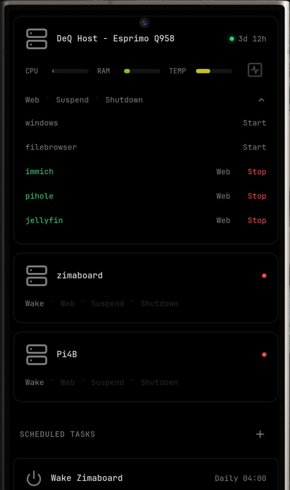
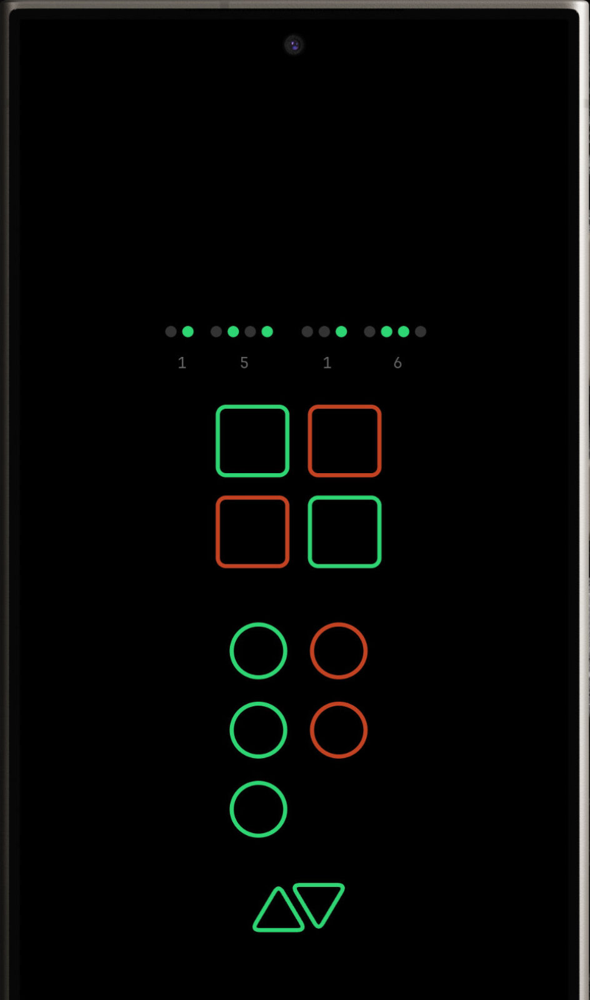
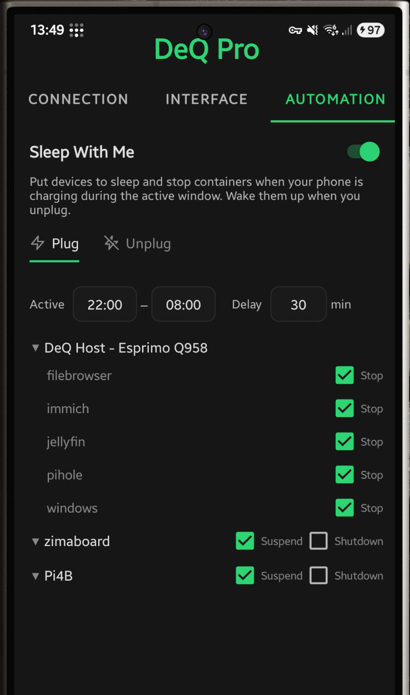
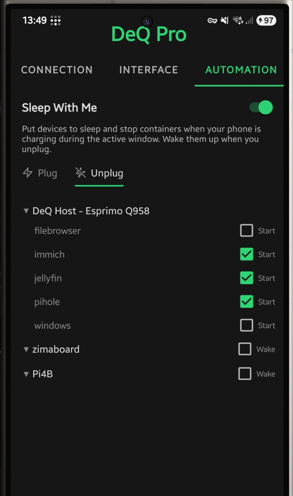
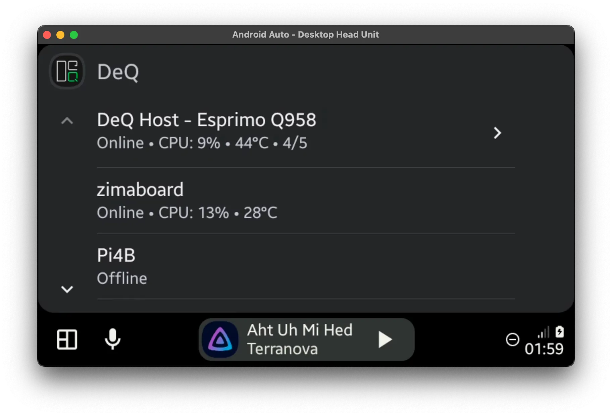
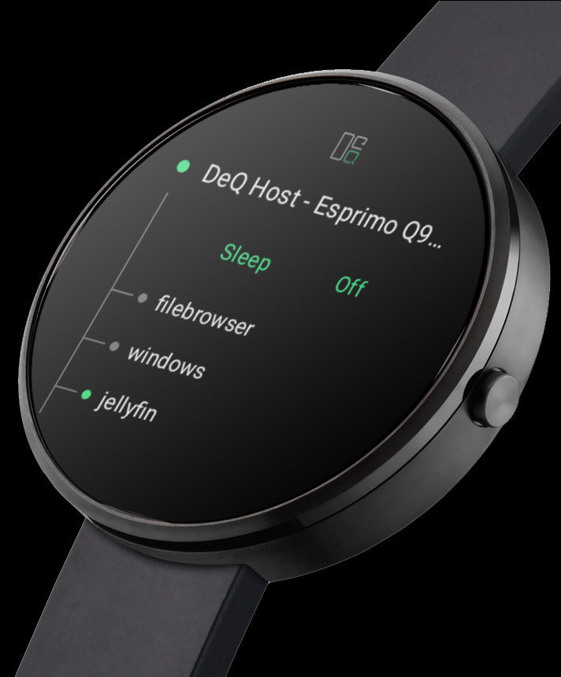
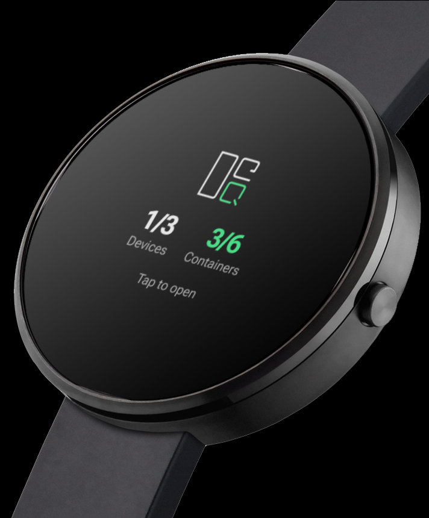
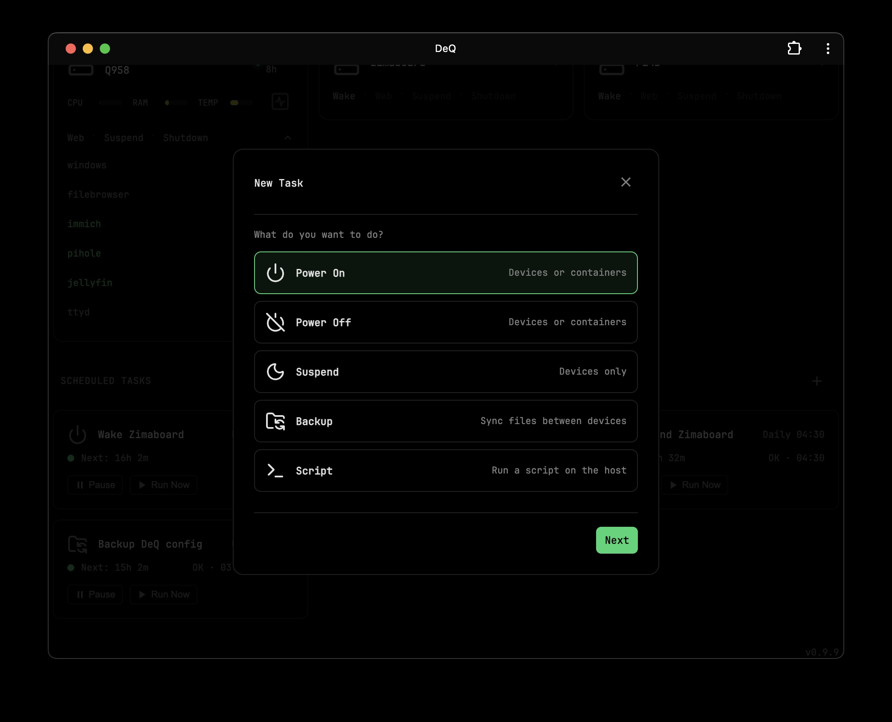

# DeQ

<p align="center"><strong>Your homelab under control. From anywhere.</strong></p>

<p align="center">
A single Python file providing SSH-based control via a web interface,
connected to a native Android app, Wear OS, and Android Auto.
<br><br>
<strong>Zero dependencies. Dynamic config. No YAML.</strong>
</p>


<p align="center">
<a href="https://deq.rocks">Website</a> ·
<a href="https://deq.rocks/documentation.html">Documentation</a> ·
<a href="https://deq.rocks/faq.html">FAQ</a> ·
<a href="https://deq.rocks/press.html">Press Kit</a> ·
<a href="https://patreon.com/deqrocks">Patreon</a>
</p>

## Table of Contents

- [Features](#features)
- [Concept](#concept)
  - [Ambitions](#ambitions)
  - [Architecture](#architecture)
  - [Connectivity](#connectivity)
- [Free Android App](#free-android-app)
- [Paid Android Pro App](#paid-android-pro-app)
- [Installation](#installation)
- [Screenshots](#screenshots)
- [License](#license)
- [Credits](#credits)
<br><br>

## Features

- **Onboarding** – Automatic device and container population
- **Native Android App** - Background monitoring, push notifications, widgets, Android Auto, Wear OS
- **DeQ Nodes** - Devices with app connect to a node network that can WOL your server when you're not at home
- **Device Control** - Wake-on-LAN, shutdown, suspend, Docker start/stop
- **Device Monitoring** - CPU load, temp, SMART... with alarm thresholds
- **File Manager** - Dual-pane browser, copy/move/upload between devices
- **Scheduled Tasks** - Wizard guided automated backups, wake, shutdown, and scripts
- **Extension API** - Write Python extensions. Build custom GUIs. Make DeQ whatever you need.
- **HTTP API** - Connect Home Assistant, Tasker, or build your own automations
- **Theming** - Custom colors, wallpapers, transparency effects
- **Quick Stuff** - Bookmark and script runner buttons with support for Lucide, Dash...
- **PWA Support** - Install as app on any device
- **Admin Auth** - Adds an additional security layer
<br><br>


## Concept

### Ambitions

- Less, but better. Lateral thinking over complexity.
- Use what’s there. Move fast. Make it useful.

DeQ is an ultra-lightweight network control layer that exposes the raw power of SSH on mobile devices — without unnecessary abstraction.
<br><br>

### Architecture

At the core of DeQ is a single Python file: `server.py`.
It lives on your server and acts as the entire control layer.

What makes it powerful — yet lightweight — is its restraint.
DeQ is essentially SSH commands wrapped in a thin, vanilla Python shell.
There are no dependencies beyond Linux and Python.
The same file serves a dashboard-like web interface.
It is mobile-first, responsive, and accessible from any browser.

We deliberately restrict `server.py` to a maximum size of 500 KB.
It currently sits at around 350 KB.
A typical fresh installation, managing a few devices, containers, and tasks,
uses roughly 20 MB of RAM and virtually no CPU.
<br><br>

### Connectivity

The native Android app, Android Auto, and Wear OS sync directly with `server.py`.
The server, in turn, connects to your host and other network devices via SSH.

DeQ is not a dashboard. DeQ is a control layer disguised as a dashboard.
It is a well-connected control layer with access to core homelab functions
such as Wake-on-LAN, task scheduling, and file management —
as well as sensors and context from your mobile devices.

For example, the Android app can automatically put selected containers or servers
to sleep when you plug in your phone at night —
and wake them again when you unplug it in the morning.

### Your Control Layer

The core remains lean. How you extend it is up to you.

HTTP API connects Home Assistant, Tasker, or your custom scripts.
Extension API lets you write Python that adds custom sections to the web interface.
Drop shell scripts into `/opt/deq/scripts/` for quick automation.

DeQ provides the infrastructure. You build what you need.


---
## Free Android App
<p align="center">


</p>
<p align="center"><em>Push notifications · Full web interface</em></p>

Native companion app with background monitoring and push notifications when devices go offline, containers stop, or backups fail. **Ad-Free**

<p align="center">
<a href="https://play.google.com/store/apps/details?id=com.deq.app"></a>
<a href="https://github.com/deqrocks/deq/releases"></a>
</p>

## Paid Android Pro App
<p align="center"></p>
<p align="center"><em>Ambient Mode with BCD clock</em></p>

**DeQ Pro** adds powerful automation and visualization features. Your purchase keeps this project alive as a full-time effort.


<table align="center">
  <thead>
    <tr>
      <th>Feature</th>
      <th>Description</th>
    </tr>
  </thead>
  <tbody>
    <tr>
      <td><strong>Widgets</strong></td>
      <td>5 widget styles for home and lock screen</td>
    </tr>
    <tr>
      <td><strong>Live Wallpaper</strong></td>
      <td>Animated status display as background</td>
    </tr>
    <tr>
      <td><strong>Ambient Mode</strong></td>
      <td>Wall-mount display with BCD clock, OLED optimized</td>
    </tr>
    <tr>
      <td><strong>Android Auto</strong></td>
      <td>Homelab status in your car</td>
    </tr>
    <tr>
      <td><strong>Wear OS</strong></td>
      <td>Watch app, tile, and complications</td>
    </tr>
    <tr>
      <td><strong>Sleep With Me</strong></td>
      <td>Homelab sleeps when you sleep</td>
    </tr>
  </tbody>
</table>
<br>


<p align="center">


</p>
<p align="center"><em>Sleep With Me: Plug in to sleep · Unplug to wake</em></p>

<p align="center">

</p>
<p align="center"><em>Android Auto integration</em></p>

<p align="center">


</p>
<p align="center"><em>Wear OS app · Quick tile</em></p>
<p align="center">
<a href="https://play.google.com/store/apps/details?id=com.deq.app.pro"></a>
</p>

## Installation

```bash
wget https://github.com/deqrocks/deq/releases/latest/download/deq.zip
unzip deq.zip -d deq && cd deq
sudo ./install.sh
```

The installer asks a few questions and gives you your access URL.

**Full setup guide:** [deq.rocks/documentation](https://deq.rocks/documentation.html)

## Screenshots

<p align="center"></p>
<p align="center"><em>User onboarding wizard</em></p>

<p align="center"></p>
<p align="center"><em>Dual-pane file manager (desktop)</em></p>

<p align="center"></p>
<p align="center"><em>Dual-pane file manager (phone)</em></p>

<p align="center"></p>
<p align="center"><em>Task scheduler</em></p>

<p align="center"></p>
<p align="center"><em>Desktop PWA</em></p>

## License

CC BY-NC 4.0 - Free for personal use, no commercial use without permission.

## Credits

- [Lucide Icons](https://lucide.dev)
- [Dashboard Icons](https://github.com/walkxcode/dashboard-icons)
- [JetBrains Mono](https://www.jetbrains.com/mono/)
